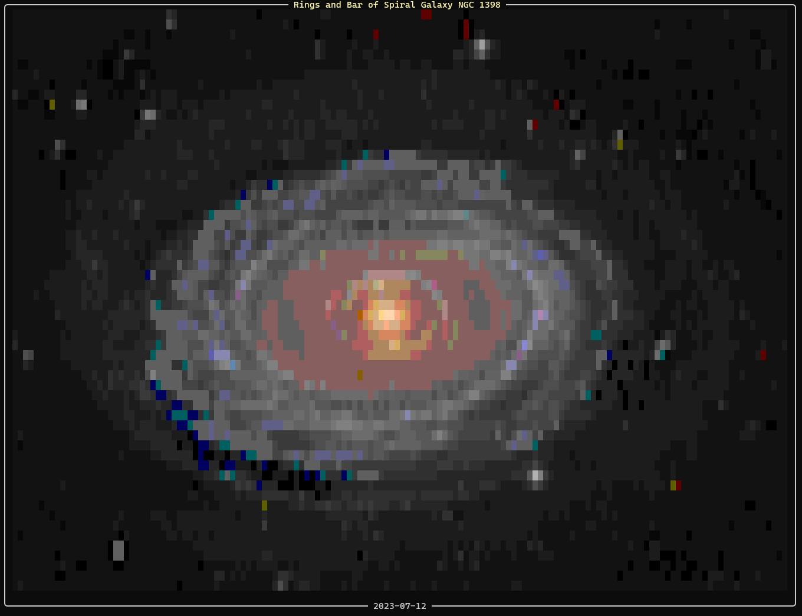

# 🛰️ NASA Space Voyager CLI

A lightweight CLI application that fetches daily astronomical images from NASA's APOD API and renders them directly in the terminal using TrueColor ANSI blocks.



## ✨ Features

- **NASA APOD API:** Live and historical astronomical photo search by date (`YYYY-MM-DD`).
- **TrueColor Rendering:** High-resolution image-to-ANSI (`█`) conversion with `Pillow` and `Rich`.
- **Aspect Ratio Correction:** Proportional 1:2 scaling for terminal grids.
- **In-Memory Streaming:** Fast binary processing via `io.BytesIO` without saving files to disk.

## 🛠️ Stack

- **Python 3.10+**
- **Libraries:** `rich`, `Pillow`, `requests`
- **Environment:** Ubuntu (WSL 2)

## 🚀 Quick Start

```bash
# 1. Clone repo
git clone git@github.com:qweezq/nasa-space-voyager.git
cd nasa-space-voyager

# 2. Setup environment
python3 -m venv .venv
source .venv/bin/activate
pip install -r requirements.txt

# 3. Set API Key
export NASA_API_KEY="your_api_key"

# 4. Run
python3 main.py
```